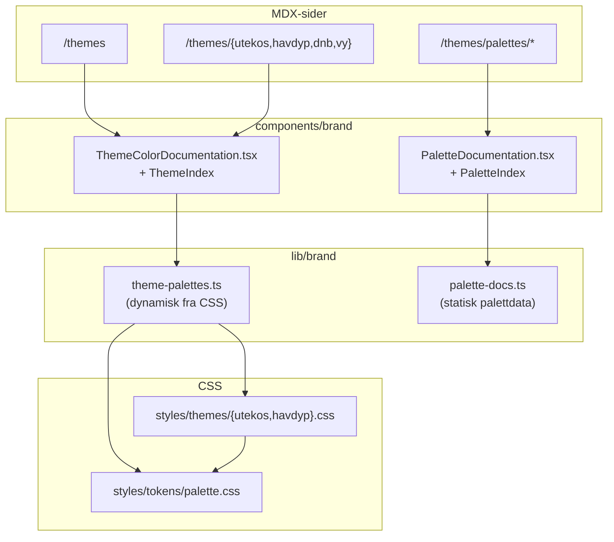

# Theme/palette full file solution

## Mål

Erstatte dagens fragmenterte theme-visning med én tydelig dokumentasjonslinje:

```txt
components/brand/*
lib/brand/*
styles/tokens/*
styles/themes/*
src/app/(brand)/themes/*
```

Ikke to parallelle sannheter (`src/components/theme/*` + `components/brand/*`).

## Arkitektur etter endring



## Fase 1 — Kopier/erstatt filer fra løsningsdokumentet

### Nye filer

| Fil                                                                                                              | Innhold                                                                     |
| ---------------------------------------------------------------------------------------------------------------- | --------------------------------------------------------------------------- |
| [`lib/brand/palette-docs.ts`](lib/brand/palette-docs.ts)                                                         | Statisk data for 6 paletter + `getPaletteDoc()` / `getPaletteDocIndex()`    |
| [`components/brand/PaletteDocumentation.tsx`](components/brand/PaletteDocumentation.tsx)                         | Full palettside: grid, derived scales, fargepsykologi, tokens, UI-eksempler |
| [`src/app/(brand)/themes/palettes/hovedpalett/page.mdx`](<src/app/(brand)/themes/palettes/hovedpalett/page.mdx>) | + 5 tilsvarende under `palettes/`                                           |

### Erstatte helt

| Fil                                                                                            | Endring                                                                                                                                                                     |
| ---------------------------------------------------------------------------------------------- | --------------------------------------------------------------------------------------------------------------------------------------------------------------------------- |
| [`components/brand/ThemeColorDocumentation.tsx`](components/brand/ThemeColorDocumentation.tsx) | Selvforsynt: `ThemeColorDocumentation` + `ThemeIndex` + interne `ThemeColorGroup`/`ThemeColorTile`/`ThemeIndexSwatches`. Filtrerer bort `plan-*` og `brand-token-*` grupper |
| [`styles/tokens/palette.css`](styles/tokens/palette.css)                                       | Utvides fra 15 til ~90 primitive tokens (maritime, secondary, amber, yellow, teal, primary-blue scales)                                                                     |
| [`styles/themes/utekos.css`](styles/themes/utekos.css)                                         | Ny `--token-color-*` semantikk + shadcn compatibility layer (light/dark)                                                                                                    |
| [`styles/themes/havdyp.css`](styles/themes/havdyp.css)                                         | Samme mønster som utekos                                                                                                                                                    |
| [`src/app/(brand)/themes/page.mdx`](<src/app/(brand)/themes/page.mdx>)                         | Importer `ThemeIndex` fra `@/components/brand/ThemeColorDocumentation`                                                                                                      |
| Theme MDX-sider                                                                                | Oppdater intro-tekst for `utekos`, `havdyp`, `dnb`, `vy` i tråd med løsningsdokumentet                                                                                      |

**Ikke endret av løsningen:** [`src/app/(brand)/themes/custom/page.mdx`](<src/app/(brand)/themes/custom/page.mdx>) — beholdes uendret; skjules fra ny index via `filter(item => item.theme !== "custom")`.

## Fase 2 — Nødvendige tilpasninger utenfor løsningsdokumentet

Løsningsfilen refererer felter som mangler i dagens [`lib/brand/theme-palettes.ts`](lib/brand/theme-palettes.ts):

1. **`summary: string`** på `ThemePalette` — brukes i ny header (`palette.summary`). Legg til korte summaries i hver `build*Palette()`.
2. **`description?: string`** på `ThemePaletteGroup` — brukes valgfritt i ny `ThemeColorGroup`-header; TypeScript krever feltet selv om ingen grupper fyller det inn ennå.
3. **Oppdater `buildUtekosPalette()` / `buildHavdypPalette()`** `sourceLabel`/`sourceDetail` til å matche ny CSS-kilde (ikke lenger `PLAN.md`-tung visning på theme-sider).

`theme-palettes.ts` trenger **ikke** større refaktor — den leser fortsatt CSS dynamisk og vil plukke opp nye `--token-color-*` og compatibility-variabler automatisk.

## Fase 3 — Layout-fiksen (hovedpoenget)

Dagens [`src/components/theme/ThemeColorGroup.tsx`](src/components/theme/ThemeColorGroup.tsx) bruker smale 2–3-kolonne cards uten store fargeflater.

Ny løsning:

- **Auto-fit grid** med `minmax(min(100%, 12rem), 1fr)` og `aspect-[4/3]` swatches
- **Token-navn/metadata** flyttet til egen `ThemeTokenDetails`-seksjon under gridet
- **Palettsider** får i tillegg derived scales (`color-mix`), fargepsykologi og UI-eksempler via `PaletteDocumentation.tsx`

## Fase 4 — Kontrollert sletting av `src/components/theme/*`

**Ikke slett blindt.** Prosedyre:

```bash
rg "@/components/theme|components/theme|from ['\"]@/components/theme|from ['\"].*/theme" .
```

Per nå peker kun disse på gamle filer:

- [`components/brand/ThemeColorDocumentation.tsx`](components/brand/ThemeColorDocumentation.tsx) → erstattes i Fase 1
- [`src/app/(brand)/themes/page.mdx`](<src/app/(brand)/themes/page.mdx>) → erstattes i Fase 1

Etter Fase 1 + grønn `rg`:

```bash
rm -rf src/components/theme
```

Slett også tom [`components/brand/ThemeColorFile.tsx`](components/brand/ThemeColorFile.tsx) dersom den fortsatt er ubrukt.

## Fase 5 — Verifikasjon

```bash
pnpm lint
pnpm typecheck
pnpm build
```

Manuell sjekk:

- `/themes` — theme-kort + palett-indeks
- `/themes/utekos` — stor grid, semantikk light/dark, ingen `plan-*`-grupper
- `/themes/palettes/hovedpalett` — derived scales, fargepsykologi, UI-eksempler
- Bytt theme i UI — bekreft at nye `utekos.css`/`havdyp.css` tokens faktisk endrer utseende

## Risiko / merknader

- **Maritime Secondary** er eksplisitt arbeidsforslag (`#055F5F`-rampe) — markert i `palette-docs.ts`, ikke presentert som etablert source-of-truth.
- **CSS-endring påvirker faktisk app-tema** — utekos/havdyp går fra direkte shadcn-variabler til `--token-color-*` + compatibility layer. Dette er bevisst og matcher løsningsdokumentet.
- **Sidebar-nav** ([`src/config/brand-navigation.ts`](src/config/brand-navigation.ts)) oppdateres ikke — palettsider nås via `/themes`-indeksen. Kan utvides senere om ønskelig.
